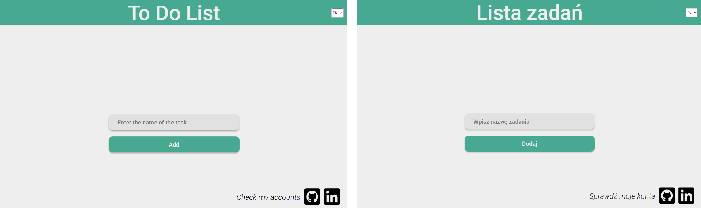
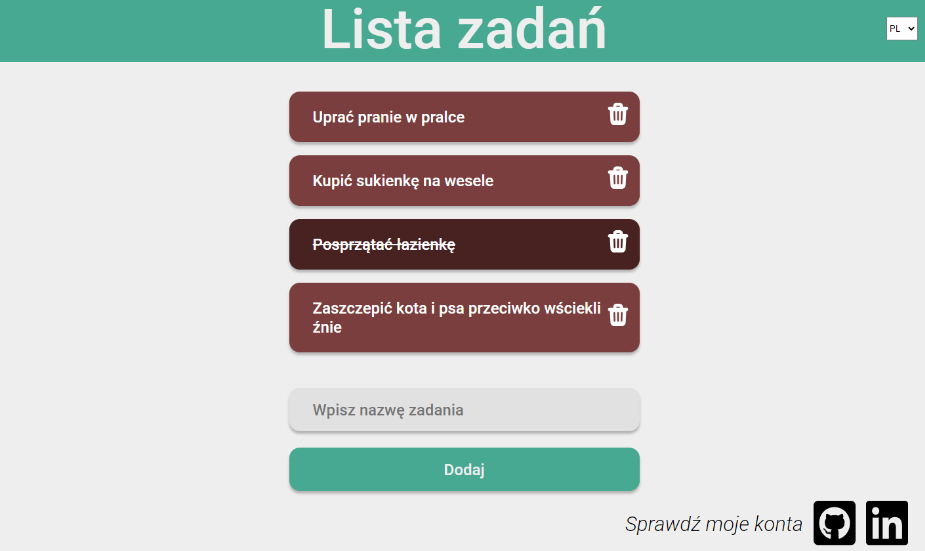
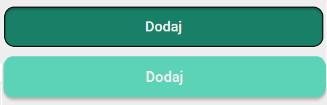
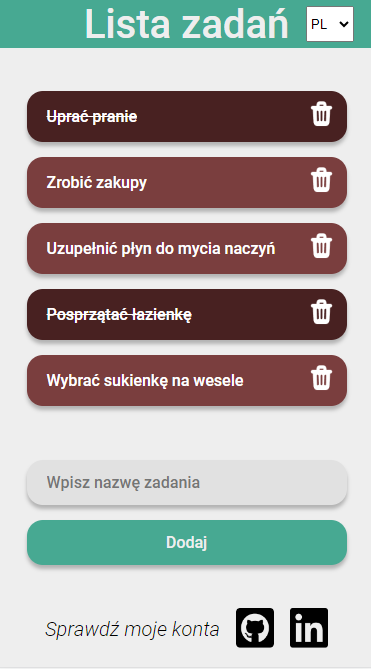

# To Do List

A web application that allows users to create their own task list.

## See the website

Click to see the website
[Link](https://weronikaczepiela.github.io/to-do-list/)

## Description

The web application allows you to create your own 'to do' list. The entire site is available in Polish and English - depending on the user's choice. The form allows the user to add a new task. Then a new block appears with the previously entered content. Clicking on a given block crosses out the text and changes the color of the block. This suggests that the task has been completed. You can also click the trash can icon. Then the task completely disappears from the list.
The created task list is saved in memory and is available unchanged when the page is refreshed.
In addition, at the bottom of the web page there are references to the author's accounts of the page.

## Features

* When opening the page, a form is displayed to add a new task. After typing in the task, it can be added by clicking the 'Add' button or pressing the enter key.
* The user can choose the language in which he wants to create the list. Depending on his choice, the header and other subtitles are in Polish or English.
* When you add a new task, it appears on the page as a new block. Clicking on the text crosses it out.  The color of the block also changes. On the other hand, clicking on the trash can icon permanently deletes the task in question.
* The block with the added task matches in height with the length of the task content.
* The 'Add' button changes appearance when you hover over it with the mouse and when it is pressed.
* The created task list is automatically saved. When you refresh the page, the previously entered tasks are still available, and the status of the corresponding blocks remains unchanged.
* When you click on the graphics at the bottom of the page, the author's account opens in a new tab.

## Application layout

* Below are screenshots showing the appearance of the application depending on the choice of language.

* Added To Do List.

* Changing the appearance of the 'Add' button.

* Mobile version. 

## How to run?

`npm run start` to start project 